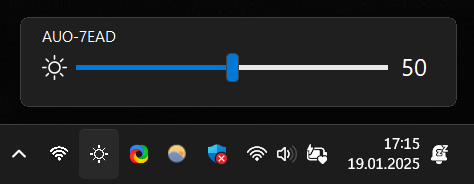
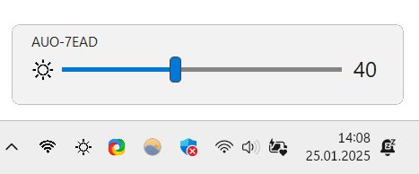
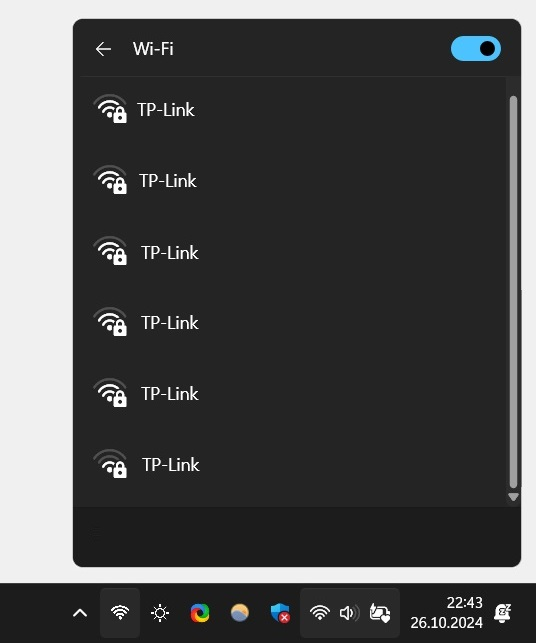
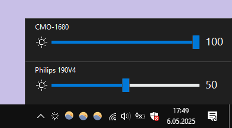
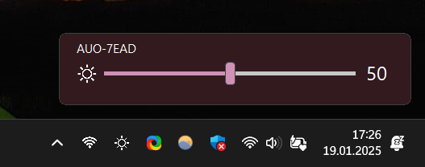

# Win10_BrightnessSlider

this app puts a Monitor Brightness icon into Taskbar Tray. So you can access it with 1 click.
targeting laptops. 

* **supported os**:  win7 , win8 , win10 , win11  - [**Download**](https://github.com/blackholeearth/Win10_BrightnessSlider/releases)  -  [**ChangeLog**](https://github.com/blackholeearth/Win10_BrightnessSlider/releases)  
 
* **requirements**: 
  * [.Net Framework 4.7.2](https://dotnet.microsoft.com/en-us/download/dotnet-framework/thank-you/net472-offline-installer) (win7 may need to install)
  * for ddci monitors, ([enable ddci on monitor menu](enable%20ddc-ci.jpg?raw=true)
)
  * install/update your graphic driver 

-------------------
**DONATE** -  **via bitcoin:** 1A2CcDwWJ9MLuZaGUy5izNTZdWVnrQ9hWh

   bitcoin QR Code: 

   

--------------------

#### Star Velocity
 

#### Features

* Supports ddc/ci monitors 
* Seperate Sliders For Multiple Monitors
* Volume like Slider to Change Monitor Brightness
* Option to Run At Startup
* Ability to *"Rescan/Detect Monitor"* after a Monitor Plugged in/out

#### ScreenShots

|**.**|**.**|**.**| 
|:---:|:---:|:---:| 
| win11 |      |     |
| win10 | |  |   
| win  |   |   win10 /11 custom Theme   |

#### NOTES   
* if slider was working. but suddenly (you plug/unplug monitor/MirrorScreen in any way) then screen act up weird for second.
 you CAN get error while trying to change birghtness, you gotta press "Detect monitor".  

#### **About VirusAlert**: 
   * you can submit *slider.exe* to microsoft yourself. please be proactive.. guys..
     * https://www.microsoft.com/en-us/wdsi/filesubmission

#### **Source Code**: 
   *  is uptodate right now. 

#### **Pull Request**: 
   * PR's are welcome, 
   * try to make changes as minimal as possible. 
   * if you add too much code, refactor your functions into another class. use it from there.

