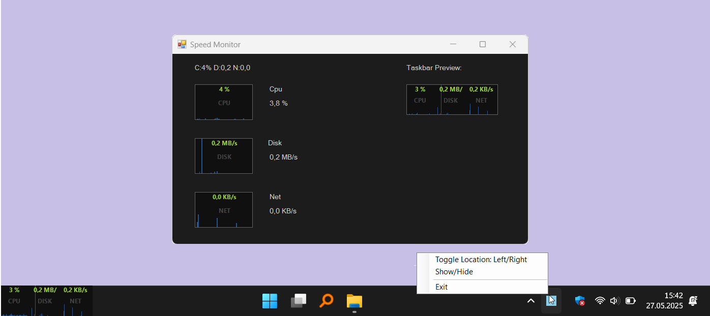

### Speed Monitor at Taskbar

this project is inspired by [taskbar-monitor](https://github.com/leandrosa81/taskbar-monitor) .

it directy draws on screen.  

#### Why?

* i dont like that taskbar-monitor uses deskband. which uses regasm, com etc.
* sometimes it doesnt work.
* looks like, its hard to debug.!?

 

